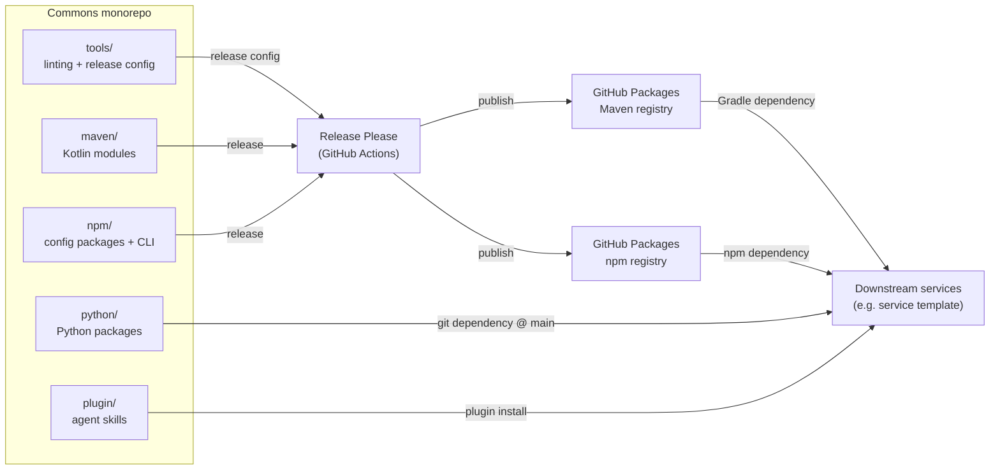
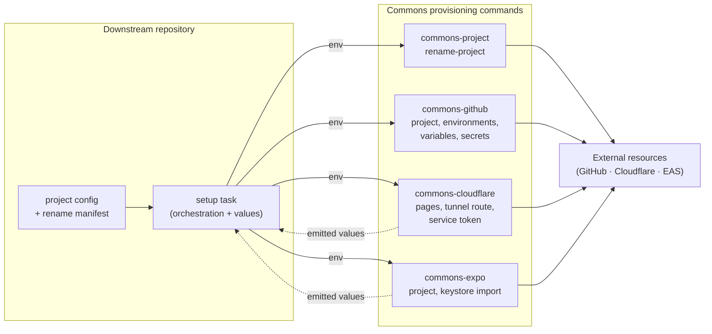
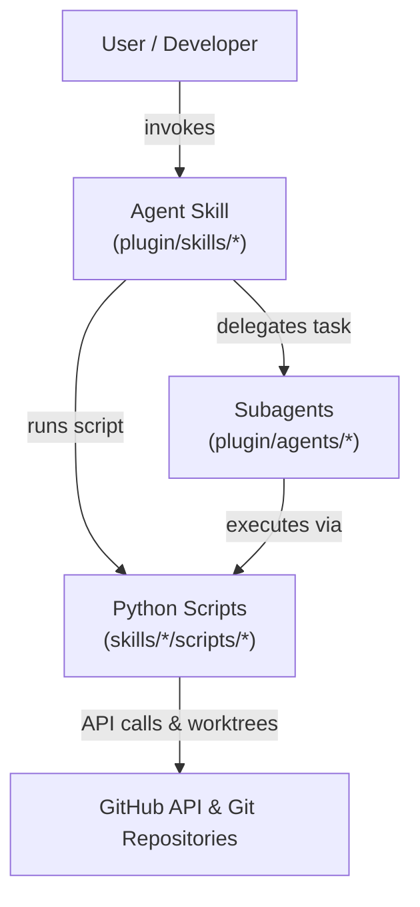
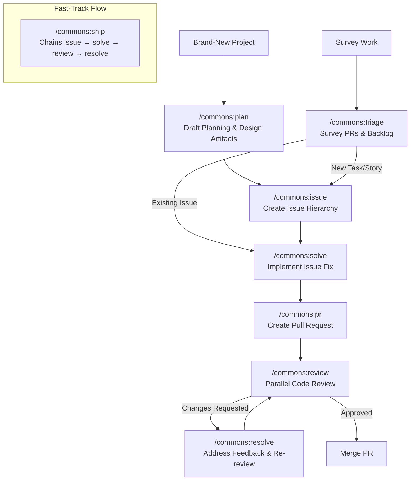

# Architecture

System-level source of truth for Commons. Contains only what spans the whole
repository; implementation detail lives in each subsystem's README.

## Data Flow

### Package Publishing & Monorepo Distribution

Commons is built and published from a single monorepo. Release Please cuts
versioned releases, the matching artifacts are published to GitHub Packages, and
downstream repositories consume them.



### Provisioning Commands & External Services

Alongside the libraries and configs it publishes, Commons publishes CLI
commands that provision the external resources a newly scaffolded project
needs. The division of responsibility is deliberate: Commons owns the
mechanics and stays generic, while the downstream repository owns every
project-specific value and the order the commands run in. Failures, no-ops,
and steps only a human can take (reported as action required, distinct from a
failure) are all reported explicitly.



Command and variable reference: [npm/README.md](../npm/README.md).

### Agent Skill & Subagent Execution

The agent plugin packages reusable workflows (`skills/`) and subagent prompts
(`agents/`). Agent skills delegate task execution to specialized subagents
or deterministic Python scripts, which execute GitHub GraphQL/REST operations
and manage git worktrees.



#### Skill Selection & Development Lifecycle Flow



## Infrastructure Overview

| Layer             | Technology                                               | Hosting                                       |
| :---------------- | :------------------------------------------------------- | :-------------------------------------------- |
| Backend libraries | Java 25 · Kotlin 2.4 · Gradle 9.6 · Spring Boot 4.1      | GitHub Packages (Maven registry)              |
| Frontend configs  | Node 20+ · PNPM 11.9 · TypeScript 6 · ESLint 9 · Turbo 2 | GitHub Packages (npm registry)                |
| Tooling configs   | PNPM 11.9 · markdownlint-cli2 · commitlint               | `tools/` (not published)                      |
| Python tooling    | Python 3.13 · uv · ruff · coverage · hatchling           | git dependency pinned to `main` (no registry) |
| Agent skills      | Markdown `SKILL.md`                                      | GitHub repository (Claude Code plugin)        |
| CI/CD             | GitHub Actions · Release Please                          | GitHub-hosted runners                         |

## Project Structure

```text
.
├── tools/      # shared linting configs, commitlint, and release-please config
├── .github/    # CI/release workflows and issue/PR templates
├── docs/       # system-level documentation
├── maven/      # Kotlin backend modules and the Gradle convention plugin
├── npm/        # frontend configuration packages and the API CLI
├── python/     # Python package(s): shared ruff/coverage config + CLI, git dependency @ main
└── plugin/     # Claude Code plugin (skills/, agents/, shared/), the only tree consumers install
```
