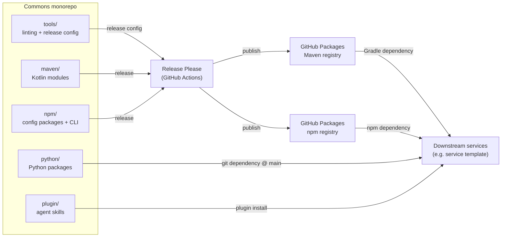

# Architecture

System-level source of truth for Commons. Contains only what spans the whole
repository; implementation detail lives in each subsystem's README.

## Bird's Eye View

Commons is a monorepo of independently buildable units, built and published
from a single repository. Release Please cuts versioned releases, the
matching artifacts are published to GitHub Packages, and downstream
repositories consume them as pinned dependencies rather than copied files.



### Infrastructure Overview

| Layer              | Technology                                               | Hosting                                        |
| :----------------- | :------------------------------------------------------- | :--------------------------------------------- |
| Backend libraries  | Java 25 · Kotlin 2.4 · Gradle 9.6 · Spring Boot 4.1      | GitHub Packages (Maven registry)               |
| Frontend configs   | Node 20+ · PNPM 11.9 · TypeScript 6 · ESLint 9 · Turbo 2 | GitHub Packages (npm registry)                 |
| Tooling configs    | PNPM 11.9 · markdownlint-cli2 · commitlint               | `tools/` (not published)                       |
| Python tooling     | Python 3.13 · uv · ruff · coverage · hatchling           | git dependency pinned to `main` (no registry)  |
| Agent skills       | Markdown `SKILL.md`                                      | GitHub repository (Claude Code plugin)         |
| CI/CD              | GitHub Actions · Release Please                          | GitHub-hosted runners                          |

### External Boundaries

- **GitHub Packages** (Maven and npm registries) is the only distribution
  channel for `maven/` and `npm/`; there is no PyPI-equivalent for `python/`,
  so it is consumed as a git dependency pinned to `main` instead.
- **Downstream services** (e.g. the service template) are the consumers on
  the other side of every published boundary; they pin versions rather than
  floating, except for `python/` (pinned to `main`) and `plugin/` (no
  versioning at all: see [`plugin/README.md`](../plugin/README.md)).
- **External provisioning targets** (GitHub, Cloudflare, EAS) are configured
  by CLI commands published from `npm/`, not by Commons itself; see
  [`npm/README.md`](../npm/README.md#usage) for that boundary.

## Code Map

```text
.
├── tools/      # shared linting configs, commitlint, and release-please config
├── .github/    # CI/release workflows and issue/PR templates
├── docs/       # system-level documentation
├── maven/      # Kotlin backend modules and the Gradle convention plugin
├── npm/        # frontend configuration packages and the API CLI
├── python/     # Python package(s): shared ruff/coverage config + CLI, git dependency @ main
└── plugin/     # Claude Code plugin (skills/, agents/, shared/), the only tree consumers install
```

Domain boundaries follow the top-level directories: each is an independently
buildable, independently released unit with its own toolchain, and none
imports source from another at build time. `plugin/` is the exception worth
naming explicitly: `.claude-plugin/marketplace.json` at the repository root
points its `source` at `plugin/` alone, so installing the plugin fetches only
that tree, never the rest of the monorepo.

Within a module, boundaries follow
[Vertical Slice Architecture](https://deviq.com/architecture/vertical-slice-architecture/)
per [`CONTRIBUTING.md#architecture`](../.github/CONTRIBUTING.md#architecture):
each slice organizes its own internals and exposes only a narrow public
contract, and shared code never depends on a slice.

## Cross-Cutting Concerns

- **Release automation**: Release Please drives versioning and changelogs for
  `maven/`, `npm/`, and `tools/`; `.github/workflows/release.yaml` publishes
  the matching artifacts when a release touches that path. `python/` and
  `plugin/` opt out (see their own READMEs for why).
- **Documentation conventions**: README, `ARCHITECTURE.md`, `API.md`, and
  `DESIGN.md` formats are standardized repository-wide, per
  [`CONTRIBUTING.md#documentation`](../.github/CONTRIBUTING.md#documentation).
- **Idempotent provisioning commands**: the CLI commands published from
  `npm/` that provision external resources (GitHub, Cloudflare, EAS) all
  follow one contract: no arguments, inputs from `process.env`, fail fast
  naming every missing variable at once, and idempotent re-runs. Detailed in
  [`npm/README.md`](../npm/README.md#usage).
- **Owner-aware doc comments**: every language toolchain in this repo
  (TypeScript, Kotlin, Python) enforces the same rule: whatever is required
  to carry a doc comment (JSDoc/KDoc/docstring) is also the only thing
  allowed to have one. See each module's own Development section for the
  specific lint rules.
