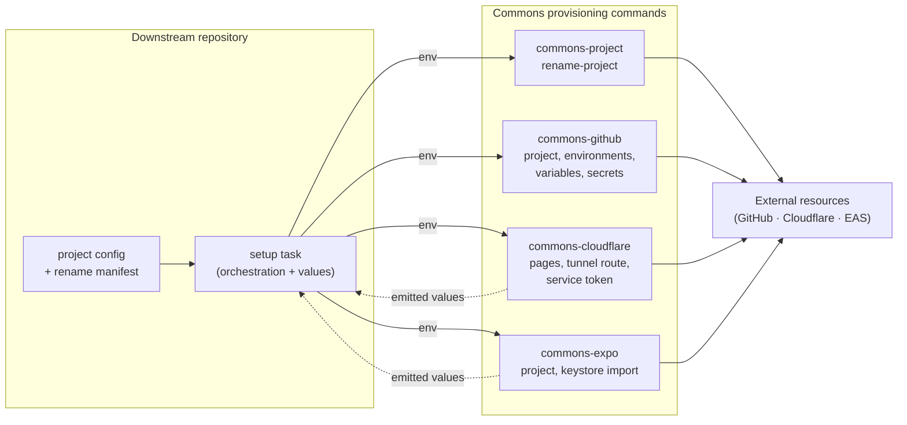

# NPM

Frontend configuration packages and tooling, published to GitHub Packages
under the `@aimarchirico` scope and managed as a PNPM workspace.

## Install

Requires Node 20+, PNPM 11.9, and [Task](https://taskfile.dev).

No local `.env` is required for development. Publishing reads credentials
from the environment (injected by CI):

| Key               | Purpose                                  |
| :---------------- | :--------------------------------------- |
| `NODE_AUTH_TOKEN` | GitHub Packages (npm) publishing token.  |

To depend on a published package, install it from the GitHub Packages npm
registry (`https://npm.pkg.github.com`) under the `@aimarchirico` scope.

## Usage

Run from the repository root:

- `pnpm install`: install workspace dependencies.
- `task npm:check`: lint and type-check all packages.
- `task npm:fix`: auto-fix all packages.
- `task npm:publish PACKAGE=<name>`: publish a single package.

| Package                                  | Provides                                                                                                                   |
| :--------------------------------------- | :------------------------------------------------------------------------------------------------------------------------- |
| `@aimarchirico/commons-ts`               | `./eslint`, `./tsconfig.json`, `./vitest-base`: base TypeScript config, including a shared 80% Vitest coverage floor.      |
| `@aimarchirico/commons-expo`             | `./eslint`, `./tsconfig.json` config + `commons-expo build-android`, `create-project` and `import-keystore` bins.          |
| `@aimarchirico/commons-project`          | root exports (`env`, `report`, `outputs`, `cli`, `git` helpers) + `commons-project rename-project` bin.                    |
| `@aimarchirico/commons-github`           | `commons-github create-project`, `create-environments`, `sync-variables`, `set-secrets`, `materialize-templates` bins.     |
| `@aimarchirico/commons-tools`            | `./markdownlint`, `./commitlint` configs.                                                                                  |
| `@aimarchirico/commons-openapi`          | `commons-openapi generate-client` bin (`dist/bin/cli.js`) generating the OpenAPI client and docs.                          |
| `@aimarchirico/commons-cloudflare`       | `./proxy` Pages Function + `commons-cloudflare fix-assets` and provisioning bins.                                          |
| `@aimarchirico/commons-firebase-client`  | Firebase client config and `commons-firebase-client decode-google-services` bin.                                           |
| `@aimarchirico/commons-google-signin`    | Google Sign-In React context and authentication hooks.                                                                     |

### Provisioning Commands

`commons-project`, `commons-github`, `commons-cloudflare`, and `commons-expo`
publish commands that provision the external resources a newly scaffolded
project needs. The division of responsibility is deliberate: Commons owns the
mechanics and stays generic, while the downstream repository owns every
project-specific value and the order the commands run in.



Every command takes no arguments, reads its inputs from `process.env`, fails
fast naming every missing variable at once, and is idempotent: a second run
makes no destructive change and reports each resource as already present. A
downstream repository orchestrates them and supplies the values, running them
from its own lockfile rather than a floating version:

```bash
pnpm exec commons-github sync-variables
```

This also applies to `commons-project rename-project`, which runs after
`pnpm install` on a freshly generated repository: the replacement scan
ignores `node_modules`, so installing first is safe, and it means the
template's own lockfile pins the version of the tool that rewrites it.

Commands that produce values other steps consume write them as `KEY=value`
lines to the file named by `OUTPUT_FILE`, or print them with sensitive values
masked when it is unset. Each command reports how it resolved the values it
derives (the repository, the Cloudflare account, the production branch)
before it reports any resource, so a derivation made in the wrong directory
is visible before its consequences are; every derived value has an override.
Commands that drive a vendor CLI check its version first, since the output
they parse is version-specific and a floor turns a confusing parse failure
into a message naming what to fix.

Full command and environment-variable reference lives in each package's own
README: [`commons-project`](packages/commons-project/README.md),
[`commons-github`](packages/commons-github/README.md),
[`commons-cloudflare`](packages/commons-cloudflare/README.md), and
[`commons-expo`](packages/commons-expo/README.md).

## Development

### Tech Stack

Node 20+ · PNPM 11.9.0 · TypeScript 6 · ESLint 9 · Turborepo 2 ·
openapi-generator-cli 2.39 and widdershins 4 (used by `commons-openapi`).

### Folder Structure

```text
npm/
├── packages/
│   ├── commons-ts/           # shared ESLint + tsconfig (base config)
│   ├── commons-expo/         # shared Expo / React Native ESLint + tsconfig
│   ├── commons-tools/        # shared markdownlint + commitlint configs
│   ├── commons-openapi/      # OpenAPI client/docs generator CLI
│   ├── commons-cloudflare/   # Cloudflare Pages proxy, web-export fixup + provisioning CLI
│   ├── commons-project/      # project rename CLI + shared provisioning helpers
│   ├── commons-github/       # GitHub repository provisioning + documentation materializer CLI
│   ├── commons-firebase-client/ # Firebase client initialization and CLI
│   └── commons-google-signin/   # Google Sign-In React hooks and context
├── pnpm-workspace.yaml    # workspace globs (packages/*)
└── turbo.json             # check/fix task pipeline
```

`commons-expo`, `commons-tools`, and `commons-openapi` extend `commons-ts`
as a `workspace:*` dependency, so `commons-ts` is the base every other
package builds on. `commons-ts` exports raw TypeScript consumed by ESLint
and `tsc`; the runtime helpers the provisioning commands share live in
`commons-project`, which compiles to `dist`.

### Code Quality

- **Linting**: ESLint 9 flat config extending `@aimarchirico/commons-ts`.
- **Types**: `tsc` against shared `tsconfig.json`.
- **Documentation & Comments**: JSDoc required for all public exports; line
  comments and non-exported JSDoc disallowed (`commons/public-jsdoc-only`).
- **Suppression Discipline**: Descriptions required for suppressions
  (`eslint-disable`, `@ts-expect-error`); `@ts-ignore` and `@ts-nocheck`
  banned.
- **Testing & Coverage**: Vitest with an 80% coverage floor on logic
  (`./vitest-base`).
- **Caching**: Turborepo caches pipeline execution for `check` tasks
  (`turbo.json`).

## Deployment

Releases are driven by Release Please (`release-type: node`, separate PRs per
package) and published by `.github/workflows/release.yaml` when a release
touches the matching `npm/packages/*` path. Publishing runs
`pnpm publish --filter <package>` against the GitHub Packages npm registry
(`https://npm.pkg.github.com`).

## Contributing

See [CONTRIBUTING.md](../.github/CONTRIBUTING.md).

## License

[MIT](../LICENSE)
