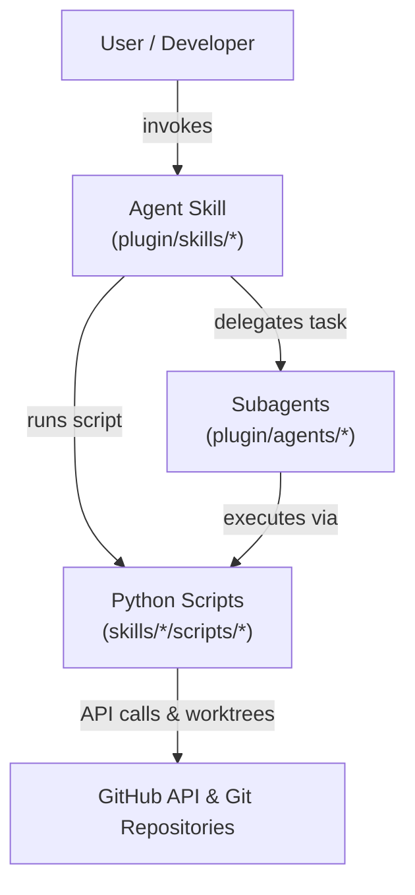
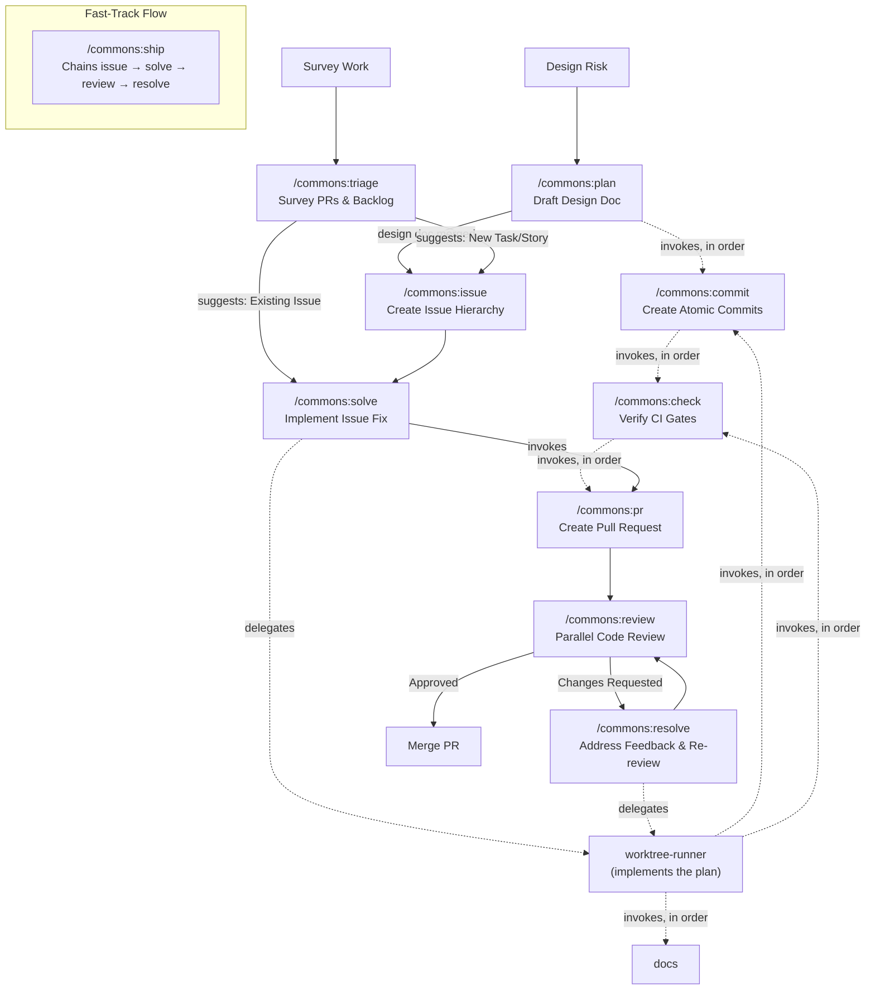

# Plugin

The `commons` Claude Code plugin: reusable agent skills covering the
development lifecycle, the subagents they delegate to, and the bundled
Git/GitHub conventions they follow. This whole directory is the plugin
source: `.claude-plugin/marketplace.json` at the repository root points its
`source` here, so installing the plugin only fetches `plugin/`, not the rest
of the monorepo.

## Install

```sh
/plugin marketplace add aimarchirico/commons
/plugin install commons@commons
```

No environment variables are required.

## Usage

Each skill directory contains a `SKILL.md` file defining its prompt
interface and workflow, invoked as a Claude Code slash command (e.g.
`/commons:solve`). Skills rely on the bundled conventions in `.github/`
rather than on each other, except for:

- `solve` / `resolve` delegating to `implementation-planner` and
  `worktree-runner` in `agents/` (which in turn invokes `check` before
  handing back).
- `review` delegating to `logic-reviewer`, `performance-reviewer`,
  `security-reviewer`, and `compliance-reviewer`.
- `ship` delegating to the `issue`, `solve`, `review`, and `resolve` skills.
- `plan` delegating to parallel `general-purpose` agents for external
  research, and to the `commit`, `check`, and `pr` skills.

Agent skills delegate task execution to specialized subagents or
deterministic Python scripts, which execute GitHub GraphQL/REST operations
and manage git worktrees:



The skills chain into a full development lifecycle, from a brand-new project
through merge:



## Development

### Tech Stack

- Markdown `SKILL.md` definitions (`name`/`description`/`argument-hint`
  frontmatter, where `description` covers both what the skill does and when
  to use it, plus a `## Workflow` section) and agent `.md` definitions
  (`name`/`description` frontmatter plus free-form instructions).
- Packaged as a Claude Code plugin (`.claude-plugin/plugin.json`).
- Python 3.13, via `uv`, for scripts under `skills/*/scripts/`.
- Self-contained: `.github/` bundles this repository's own
  `CONTRIBUTING.md` and GitHub templates, so skills reference
  `${CLAUDE_PLUGIN_ROOT}/.github/...` directly instead of depending on the
  consumer repository having materialized anything.

### Folder Structure

```text
plugin/
├── .claude-plugin/plugin.json   # plugin manifest
├── .github/                     # bundled conventions (CONTRIBUTING.md, issue/PR templates)
├── shared/                      # shared orchestration conventions (CONVENTIONS.md) & script utilities (pr_feedback.py)
├── skills/
│   ├── check/SKILL.md           # verify the tree against the project's own PR-gating CI checks
│   ├── commit/SKILL.md          # create logical, atomic commits
│   ├── docs/SKILL.md            # update project documentation
│   ├── issue/SKILL.md           # create hierarchical issues
│   ├── plan/SKILL.md            # draft a design doc for work carrying design risk
│   ├── pr/SKILL.md              # create a standardized pull request
│   ├── resolve/SKILL.md         # orchestrate the lifecycle from PR review feedback
│   ├── review/SKILL.md          # review a pull request via parallel reviewer agents
│   ├── ship/SKILL.md            # chain issue creation and solving into a single flow
│   ├── solve/SKILL.md           # orchestrate the lifecycle from an existing issue
│   └── triage/SKILL.md          # survey open PRs and Backlog issues, read-only
└── agents/
    ├── compliance-reviewer.md    # reviews a diff against CONTRIBUTING.md (read-only)
    ├── implementation-planner.md # drafts an implementation plan (read-only)
    ├── logic-reviewer.md         # reviews a diff for logic errors (read-only)
    ├── performance-reviewer.md   # reviews a diff for performance regressions (read-only)
    ├── security-reviewer.md      # reviews a diff for security vulnerabilities (read-only)
    └── worktree-runner.md        # implements an approved plan unattended
```

Complex skills pair their `SKILL.md` prompt with deterministic Python scripts
(`skills/*/scripts/`) for GitHub API operations, state tracking, and git
worktree management.

**Shared Conventions** (`shared/CONVENTIONS.md`): the single definition of the
orchestration policies more than one skill depends on, referenced by anchor the
same way skills reference `CONTRIBUTING.md` sections. `.github/CONTRIBUTING.md`
governs how code and history are authored; `CONVENTIONS.md` governs how skills
run: `#branch-setup`, `#worktrees`, `#verification`, and
`#opening-the-pull-request`. Policies that must not drift between skills (the
worktree path, the check-retry count, who owns pushing) live here rather than
being restated per skill.

**Shared Feedback State** (`shared/pr_feedback.py`): dynamically loaded by
script path to provide a single authoritative definition for open PR review
feedback across `triage` and `resolve`:

- `unresolved_threads`: Identifies review threads where `isResolved` is false.
- `comments_since_checkpoint`: Tracks comments created after the most recent
  `Resolved.` checkpoint comment.

**Skill Script Mechanics**:

- **`review`** (`skills/review/scripts/post_review_comments.py`): Separates
  inline diff findings (with `file` and `line`) from unresolvable summary
  items, posting a single atomic GitHub PR review with a verdict
  (`Approved.` vs `Changes requested.`).
- **`resolve`** (`skills/resolve/scripts/`): `fetch_pr_problems.py` uses
  GraphQL and `pr_feedback.py` to extract open review items, plus `gh pr
  view`/`gh pr checks` for conflict and failing-check state;
  `post_pr_replies.py` replies to inline comments, resolves threads via
  GraphQL mutations (`resolveReviewThread`), posts a top-level `Resolved.`
  checkpoint, and re-requests review.
- **`triage`** (`skills/triage/scripts/`): `collect_triage.py` surveys
  assigned PRs, user PRs, and project backlog items. Uses `review_state.py`
  to compute PR action buckets (`merge`, `resolve_then_merge`, `resolve`,
  `self_review`, `draft`) and `backlog_utils.py` to filter out blocked items
  and rank tasks by priority and impact.

### Code Quality

- **Markdown**: Linted with shared `markdownlint` config via `task docs:check`
  (auto-fixed with `task docs:fix`).
- **Python Scripts**: Checked with `task plugin:check` (auto-fixed with `task
  plugin:fix`), running ruff, ty, and line-length checks.

## Deployment

The plugin is distributed directly from this repository; there is no
separate publish pipeline. `plugin.json` sets no `version`, so every merged
commit is a new version; consumers pick it up on their next
`/plugin marketplace update` or background auto-update.

## Contributing

See [CONTRIBUTING.md](../.github/CONTRIBUTING.md).

## License

[MIT](../LICENSE)
